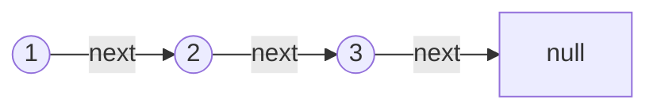
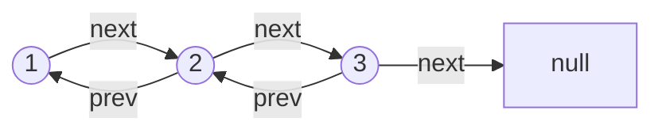
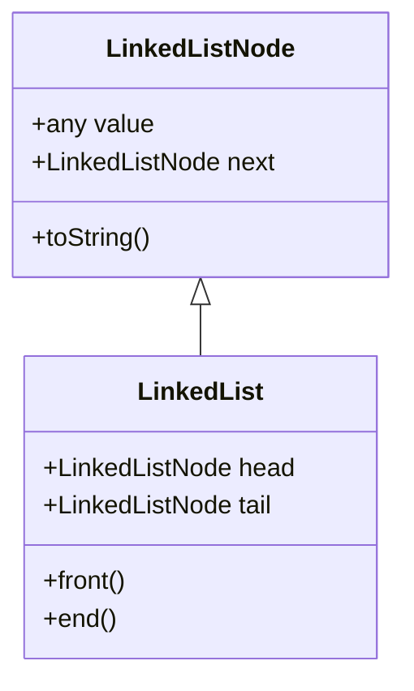

## 概述

```js
const a = 12;
```

### 分类

+ 单链表：每个节点有节点值(`value`)、下一个节点(`next`)两个属性，最后一个节点的 `next` 指向 `null`



+ 双链表：在单链表节点的基础上增加了一个属性 - 前驱节点(`prev`)




### 属性和操作

【必须】基于链表的定义，一般链表的实现都会提供一下几个基本操作：
+ `front()`：返回链表的第一个节点
+ `back()`：返回链表的最后一个节点
+ `push_back(val)`、`pop_back()`：在链表尾部添加、删除节点
+ `push_front(val)`、`pop_front()`：在链表头部添加、删除节点

【推荐】提供一些常用的初始化、转换操作：
+ `static fromArray(arr)`：用一个数组初始化链表
+ `toArray()`：将链表转换为数组
+ `toString()`：将转换为字符串

【不推荐】还会有一些时间复杂度为 $O(n)$ 的操作（多见在算法面试中）：
+ `insertBefore(val, node)`、`insertAfter(val, node)`：在值为 `val` 的节点之前、之后插入节点 `node`
+ `delete(val)`：删除值为 `val` 的节点
+ `find(val)`：查找值为 `val` 的节点
+ `reverse()`：反转链表

::: tip 备注
+ 链表的优势是其 $O(1)$ 时间复杂度的插入、删除操作，但注意的是插入、删除的位置一般是链表头部、尾部、或已确定的位置（在不确定的位置执行删除操作还有 $O(n)$ 时间复杂度的 `find()` 操作开销）
+ 如果你频繁使用了 $O(n)$ 时间复杂度的 `insert()`, `delete()`, `find()` 操作，那么你应该重新选择一个数据结构，而不是使用链表
+ 双链表和单链表的实现差不多，只是要多考虑一个 `prev` 指针
+ 尽管双链表能访问前一个节点，但是它的内存开销是单链表的**两倍**；一般来说，单链表应用更加广泛
:::

::: danger 注意指针
+ 什么是指针：在 JavaScript 中，没有纯指针的概念，可以简单地将**对对象的引用**看作指针（或者理解为浅拷贝）
+ 遍历指针：仅遍历的话，链表的内部是不会变化的
+ 修改指针：会影响所引用的对象的属性，要时刻清楚该行为带来的变化
```js
const list = new LinkedList();
let pa = list; // pa 引用了 list，理解为 pa 指向 list
pa = pa.next;  // 遍历指针，没有对原对象 list 的任意属性进行修改
pa.next = pb;  // 修改指针，对原对象 list 的某个 next 指针进行了修改
pa = pb;       // 重新赋值，即取消了对原对象 list 的引用，注意这并不是修改指针
```
:::


## 单链表

### 基础设计

+ 将单链表节点和单链表的定义区分不是必须的，但是这更符合 OOP 思想
+ 单链表节点类：只记录节点值 `value` 和 `next` 指针，这里还附加了一个 `toString()` 方法

:::: tabs
::: tab 设计
+ `LinkedListNode.js`：单链表节点
+ `LinkedList.js`：单链表
+ 继承图

:::

::: tab LinkedListNode
+ 定义每个节点的两个属性
```js
export default class LinkedListNode {
  /**
   * @param {*} value
   * @param {LinkedListNode} next
   */
  constructor(value, next = null) {
    this.value = value;
    this.next = next;
  }

  /**
   * @param {Function} callback
   */
  toString(callback) {
    return callback ? callback(this.value) : `${this.value}`;
  }
}
```
:::

::: tab LinkedList
+ 单链表类：扩充 `head`、`tail` 属性
```js
import LinkedListNode from './LinkedListNode'

export default class LinkedList {
  constructor() {
    this.head = null
    this.tail = null
  }

  front() {}
  back() {}
  pushBack(value) {}
  pushFront(value) {}
  popBack() {}
  popFront() {}

  static fromArray(arr) {}
  toArray() {}
  toString(callback) {}
}
```
:::

::: tab 更多操作
+ 一些不常用的操作，也可直接拷贝到代码中使用
+ `reverse()`
+ `find()`
+ `insertBefore()`
+ `insertAfter()`
+ `delete()`
:::

::: tab 算法模板
+ 依赖模块的合并，可以直接拷贝到 LeetCode 等算法平台中使用
```js
class LinkedListNode {

}
class LinkedList {

}
```
:::
::::


### 更多操作

:::: tabs
::: tab 插入节点

:::

::: tab 删除节点

:::

::: tab 反转链表

:::
::::


### 单链表类


::: details
```js
import LinkedListNode from './LinkedListNode'

export default class LinkedList {
  constructor() {
    this.head = null
    this.tail = null
  }

  /**
   * 在头部添加节点：修改指针即可
   * 时间：O(1)
   * 
   * @param {*} value
   * @return {LinkedList}
  */
  prepend(value) {
    const newNode = new LinkedListNode(value, this.head)
    this.head = newNode
    if (!this.tail) {     // 边界：更新 tail
      this.tail = newNode
    }
    return this
  }

  /**
   * 在尾部添加节点：修改指针即可
   * 时间：O(1)
   * 
   * @param {*} value
   * @return {LinkedList}
   */
  append(value) {
    const newNode = new LinkedListNode(value)
    if (!this.head) {     // 边界：空链表
      this.head = newNode
      this.tail = newNode
      return this
    }
    this.tail.next = newNode
    this.tail = newNode   // 边界：更新 tail
    return this
  }

  /**
   * 插入节点：创建一个指针，循环遍历链表
   * 时间：O(n)
   * 
   * @param {*} value
   * @param {number} index
   * @return {LinkedList}
   */
  insert(value, index) {
    if (index < 1) {            // 边界：无效 index
      return this
    }
    let node = this.head
    if (!node || index === 1) { // 边界：在头部添加
      this.prepend(value)
      return this
    }

    let i = 1
    // 开始迭代 node 指针，
    while (i !== index - 1 && node.next) {
      node = node.next
      i++
    }
    // i = index OR node 迭代到链表尾部
    node.next = new LinkedListNode(value, node.next)
    return this
  }

  /**
   * 删除头节点：修改指针即可
   * 时间：O(1)
   * 
   * @return {LinkedListNode}
   */
  deleteHead() {
    const deletedHead = this.head
    if (!deletedHead) {     // 边界：空链表
      return null
    }

    if (deletedHead.next) {
      this.head = this.head.next
    } else {                // 边界：删除节点后变为空链表
      this.head = null
      this.tail = null
    }
    return deletedHead
  }

  /**
   * 删除尾节点：创建一个指针，循环遍历链表
   * 时间：O(n)
   * 
   * @return {LinkedListNode}
   */
  deleteTail() {
    const deletedTail = this.tail
    if (this.head === this.tail) {   // 边界：删除节点后变为空链表
      this.head = null
      this.tail = null
      return deletedTail
    }

    // 开始迭代 node 指针
    let node = this.head
    while (node.next) {
      if (!node.next.next) {  // node 到达尾节点，结束迭代
        node.next = null
      } else {
        node = node.next
      }
    }

    this.tail = node          // 边界：更新 tail
    return deletedTail
  }

  /**
   * 删除节点：删除所有值相等的节点，并返回最后删除的节点；通过一个指针遍历链表
   * 时间：O(n)
   * 
   * @param {*} val
   * @return {LinkedListNode}
   */
  delete(val) {
    if (!this.head) {   // 边界：空链表
      return null
    }

    let deletedNode = null
    // 边界：删除的节点在头部，用 while 而不用 if：有可能连续几个要删除的元素都在开头
    while (this.head && this.head.value === val) {
      deletedNode = this.head
      this.head = this.head.next
    }

    let node = this.head
    if (node !== null) {  // 边界：非空链表才继续
      // 开始迭代 node 指针
      while (node.next) {
        if (node.next.value === val) {
          deletedNode = node.next
          node.next = node.next.next  // 删除符合条件的元素的引用
        } else {
          node = node.next
        }
      }
    }

    // 边界：删除了尾节点，更新 tail
    if (this.tail.value === val) {
      this.tail = node
    }

    return deletedNode
  }

  /**
   * 查找节点：使用一个指针迭代链表
   * 时间：O(n)
   * 
   * @param {Object} param
   * @param {*} param.val
   * @param {function} [param.callback]
   * @return {LinkedListNode}
   */
  find({ val = undefined, callback = undefined }) {
    if (!this.head) {   // 边界：空链表
      return null
    }

    let node = this.head
    // 开始迭代 node 指针
    while (node) {
      // 根据回调函数查找(优先于值查找)
      if (callback && callback(node.value)) {
        return node
      }
      // 指定查找值
      if (val !== undefined && node.value === val) {
        return node
      }
      node = node.next
    }

    return null
  }

  /**
   * 辅助方法：批量添加节点
   * 
   * @param {Array} arr
   * @return {LinkedList}
   */
  fromArray(arr) {
    arr.forEach((v) => this.append(v))
    return this
  }

  /**
   * 静态方法：根据数组生成链表
   * 
   * @param {Array} arr
   * @returns {LinkedList}
   */
  static fromArray(arr) {
    const list = new LinkedList()
    return list.fromArray(arr)
  }


  /**
   * 辅助方法：链表的数组表示
   * 
   * @return {LinkedListNode[]}
   */
  toArray() {
    let currentNode = this.head
    const nodes = []
    while (currentNode) {
      nodes.push(currentNode.value)
      currentNode = currentNode.next
    }
    return nodes
  }

  /**
   * 辅助方法：链表的字符串表示
   * 
   * @param {Function} [callback]
   * @return {String}
   */
  toString(callback) {
    return this.toArray()
      .map(node => (callback ? callback(node) : node.toString()))
      .toString()
  }

  /**
   * 辅助方法：反转链表，使用指针迭代链表
   * 时间：O(n)
   * 
   * @return {LinkedList}
   */
  reverse() {
    let currNode = this.head  // currNode 用作遍历原链表
    let nextNode = null       // nextNode ，并作为新一轮循环的 currNode
    let prevNode = null       // prevNode 保存 currNode，用作新一轮循环的 currNode.next
    while (currNode) {
      nextNode = currNode.next  // 保存 currNode.next
      currNode.next = prevNode  // 从尾部开始生成新链表指向，原链表的 head 为 新链表的 tail
      // 更新 prevNode 和 currNode 用于下一轮循环
      prevNode = currNode
      currNode = nextNode
    }
    // 更新 head 和 tail
    this.tail = this.head     // 注意：循环开始时便已设置 head.next = null
    this.head = prevNode

    return this
  }
}
```
:::


## 双链表

### 基础设计

:::: tabs
::: tab 设计

:::

::: tab DoublyLinkedListNode
```js
export default class DoublyLinkedListNode {
  /**
   * @param {*} value
   * @param {DoublyLinkedListNode} prev
   * @param {DoublyLinkedListNode} next
   */
  constructor(value, prev = null, next = null) {
    this.value = value
    this.prev = prev
    this.next = next
  }

  /**
   * @param {Function} callback
   */
  toString(callback) {
    return callback ? callback(this.value) : `${this.value}`
  }
}
```
:::

::: tab DoublyLinkedList
```js

```
:::

::: tab 算法模板
```js

```
:::
::::


### 更多操作

:::: tabs
::: tab 插入节点

:::

::: tab 删除节点

:::

::: tab 反转链表

:::
::::

### 双链表类

::: details
```js
import DoublyLinkedListNode from './DoublyLinkedListNode'

export default class DoublyLinkedList {
  constructor() {
    this.head = null
    this.tail = null
  }

  /**
   * 在尾部添加元素
   * 
   * @param {*} val
   * @returns {DoublyLinkedList}
   */
  append(val) {
    const node = new DoublyLinkedListNode(val, this.tail, null)
    // 链表为空时
    if (!this.head) {
      this.head = node
      this.tail = node
      return this
    }
    // 链表不为空时
    this.tail.next = node
    this.tail = node
    return this
  }

  /**
   * 在头部添加元素
   * 
   * @param {*} val
   * @returns {DoublyLinkedList}
   */
  prepend(val) {
    const node = new DoublyLinkedListNode(val, null, this.head)
    // 链表为空时
    if (!this.head) {
      this.head = node
      this.tail = node
      return this
    }
    // 链表不为空时
    this.head.prev = node
    this.head = node
    return this
  }

  /**
   * 在任意位置添加元素，任何不合法的 index 都默认为在尾部添加元素
   * 
   * @param {*} val
   * @param {Number} index
   * @returns {DoublyLinkedList}
   */
  insert(val, index = 0) {
    // 任何不合法的 index 都默认为在尾部添加元素
    if (index <= 0) {
      return this.append(val)
    }
    if (index === 1) {
      return this.prepend(val)
    }

    let i = 1
    let currentNode = this.head
    while (i < index && currentNode) {
      currentNode = currentNode.next
      i++
    }
    if (!currentNode) {
      return this.append(val) // 此时 index 越界，在尾部添加元素
    }

    const node = new DoublyLinkedListNode(val, currentNode.prev, currentNode)
    currentNode.prev.next = node
    currentNode.prev = node

    return this
  }

  /**
   * 删除头节点
   * 
   * @returns {DoublyLinkedListNode}
   */
  deleteHead() {
    // 空链表时
    if (!this.head) {
      return null
    }
    const currentNode = this.head
    // 只有一个节点时
    if (this.head === this.tail) {
      this.head = null
      this.tail = null
    } else {
      this.head.next.prev = null
      this.head = this.head.next
    }
    return currentNode
  }

  /**
   * 删除尾节点
   * 
   * @returns {DoublyLinkedListNode}
   */
  deleteTail() {
    // 空链表时
    if (!this.head) {
      return null
    }
    const currentNode = this.tail
    if (this.head === this.tail) {
      this.head = null
      this.tail = null
    } else {
      this.tail.prev.next = null
      this.tail = this.tail.prev
    }
    return currentNode
  }

  /**
   * 删除所有 value === val 的节点，并返回最后一个删除的节点
   * 
   * @param {*} val
   * @returns {DoublyLinkedListNode}
   */
  delete(val) {
    if (!this.head) {
      return null
    }
    let deleteNode = null
    // 在头部删除
    while (this.head && this.head.value === val) {
      deleteNode = this.head
      this.head.next.prev = null
      this.head = this.head.next
    }

    // 在中间(非头尾)删除
    let currentNode = this.head
    // 链表非空
    if (currentNode) {
      // currentNode 不是尾节点时
      while (currentNode.next) {
        if (currentNode.next.value === val) {
          deleteNode = currentNode.next
          // currentNode.next.next 不为 null 设置 prev
          if (currentNode.next.next) {
            currentNode.next.next.prev = currentNode
          }
          currentNode.next = currentNode.next.next
        } else {
          currentNode = currentNode.next
        }
      }
    }
    // currentNode 为尾节点时
    if (this.tail.value === val) {
      this.tail.prev.next = null
      this.tail = currentNode.prev
    }

    return deleteNode
  }

  /**
   * 查找元素
   * 
   * @param {Object} param
   * @param {*} param.val
   * @param {Function} param.callback
   * @return {DoublyLinkedListNode}
   */
  find({ val = undefined, callback = undefined }) {
    // 空链表
    if (!this.head) {
      return null
    }

    let currentNode = this.head
    while (currentNode) {
      // 根据回调函数查找(优先于值查找)
      if (callback && callback(currentNode.value)) {
        return currentNode
      }
      // 指定查找值
      if (val !== undefined && currentNode.value === val) {
        return currentNode
      }

      currentNode = currentNode.next
    }
    return null
  }

  /**
   * 辅助方法：反转链表
   * 
   * @return {DoublyLinkedList}
   */
  reverse() {
    let currentNode = this.head
    let prevNode = null
    let nextNode = null
    while (currentNode) {
      nextNode = currentNode.next

      currentNode.next = prevNode
      currentNode.prev = nextNode

      prevNode = currentNode
      currentNode = nextNode
    }
    this.tail = this.head
    this.head = prevNode
    return this
  }

  /**
   * 辅助方法：批量添加节点
   * 
   * @param {Array} arr
   * @return {DoublyLinkedList}
   */
  fromArray(arr) {
    arr.forEach(v => this.append(v, this.tail))
    return this
  }

  /**
   * 静态方法：通过数组构造链表
   * 
   * @param {Array} arr
   * @returns {DoublyLinkedList}
   */
  static fromArray(arr) {
    const list = new DoublyLinkedList()
    return list.fromArray(arr)
  }

  /**
   * 辅助方法：链表的数组表示
   * 
   * @returns {Array}
   */
  toArray() {
    if (!this.head) {
      return []
    }

    const res = []
    let currentNode = this.head
    while (currentNode) {
      res.push(currentNode.value)
      currentNode = currentNode.next
    }
    return res
  }

  /**
   * 辅助方法：链表的字符串表示
   * 
   * @param {Function} callback
   * @returns {String}
   */
  toString(callback) {
    return this.toArray()
      .map(node => (callback ? callback(node) : node.toString()))
      .join('<=>')
  }
}
```
:::


## 应用

### 链表算法

+ **单指针**：通常只是用于遍历，以便查找、增加、删除节点等操作，较为简单
+ **双指针**：创建并同时移动两个指针，这两个指针可以是同向的，也可以是相向的
+ **快慢指针**：常用于解决
+ **多指针**：可能是同时触发的指针，也可能是到达某个位置后才初始化的指针，难度较大，需要转化问题或更复杂的数学推导
+ **递归**：链表的结构也很适合使用递归，但是需要将问题拆解为相应的子问题，在链表中很多情况下比较难察觉


